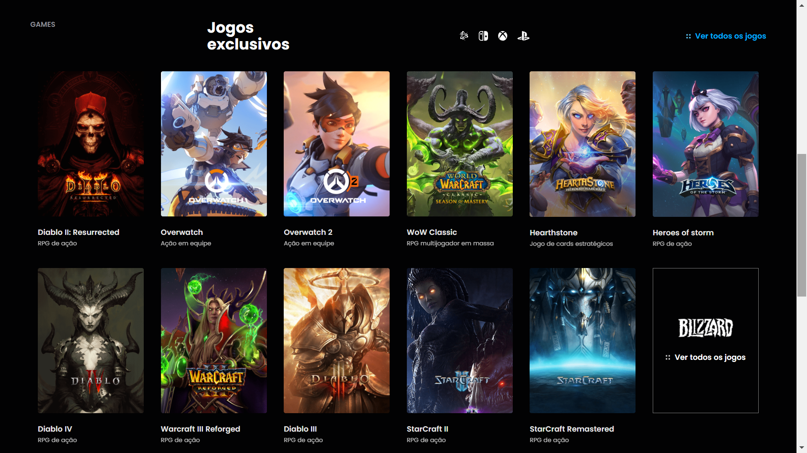
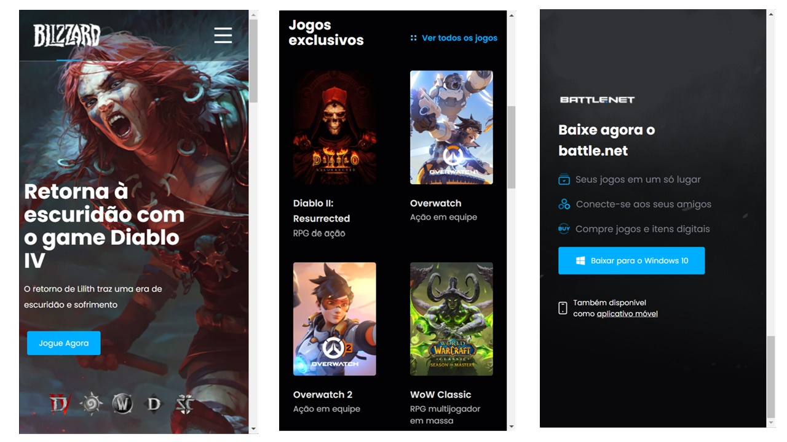

## Blizzard Land Page

An application challenge proposal by [Br Challenges](https://www.brchallenges.com/desafio/blizzard) with the purpose of practice front-end skills using React JS.

#### [Demo](https://willian-pessoa.github.io/blizzard-challenge/)

## Project Status

This project is finished. The main features are:

- Users can see a navbar menu with a hover effect in the options, the games and sports have a dropdown menu when clicked. Have two buttons, one for connect and another to create an account, both open a modal to log in.

- The first section is a banner game, which can be changed through the bar with game icons. Each banner has a trailer that plays a gif when hovered.

- The second section shows the exclusive games, the data that populates this section it is made by an API Rest. Each card with game pieces of information has an effect on the image when hovered.

- The Footer has a button with a call action to do the download that changes accordingly to the user's operating system.

## Project Screen Shot(s)

## Installation and Setup Instructions

Clone down this repository. You will need `node` and `npm` installed globally on your machine.

Installation:

`npm install`

To Start the App:

`npm start`

## Reflection

This is a front-end challenge proposal by [Br Challenges](https://www.brchallenges.com/desafio/blizzard). I had decide to do this to practice my skills in code and gain experience building something already set up in design and functionality to put in the project.

I used React JS, HTML, SCSS, and Javascript to code. The project was started using the `create-react-app` boilerplate to minimize initial setup and invest more time in diving into weird technological rabbit holes.

One of my biggest challenges was making the page responsive to all devices as asked in the challenge, the challenge in this part was because of my personal projects until now I never worry so much about this aspect that it's really important because of the huge base of mobile users. This was good because I was able to practice my CSS skill a lot.

Another good challenge I had felt, was how I can structure the code, and how to build each piece to finish the whole painting. And do this in a smart way to not write the same code over and over again. For example, build a button component, so that each part needs the button,  I just need to call the component already created. Or the card component in the exclusive games sections, with a card component, I just need to tell what is the image, title, description, and the card are created.