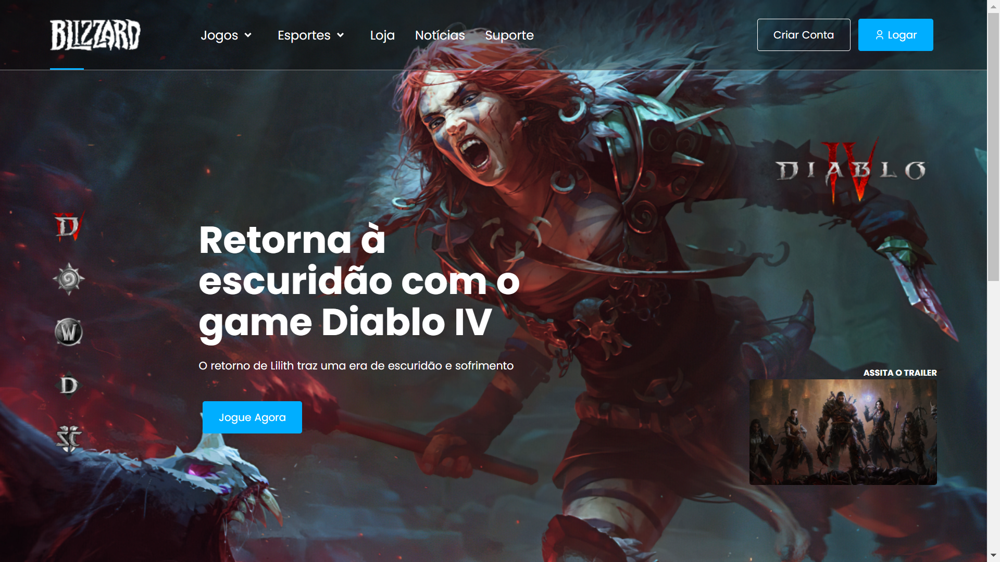
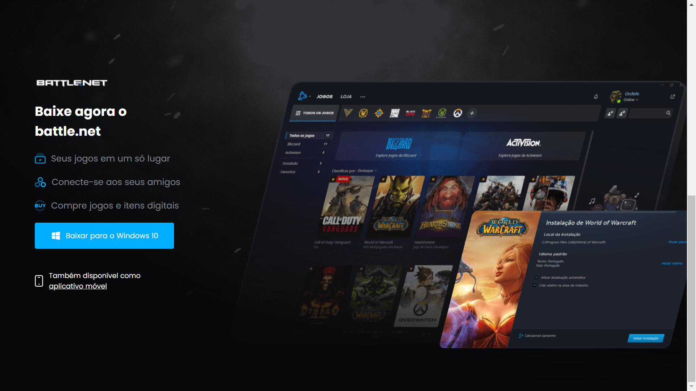

## Blizzard Land Page

An application challenge proposal by [Br Challenges](https://www.brchallenges.com/desafio/blizzard) with the purpose of practice front-end skills using React JS.

#### [Demo](https://willian-pessoa.github.io/blizzard-challenge/)

## Project Status

This project is currently in development. Users can see the navbar menu with hover effect in the options, the banner to games in the header page and change them and footer with a download button that change acorddly the user Operational system.

## Project Screen Shot(s)

## Installation and Setup Instructions

#### Example:

Clone down this repository. You will need `node` and `npm` installed globally on your machine.

Installation:

`npm install`

To Start the App:

`npm start`

## Reflection

This is a front-end challenge proposal by [Br Challenges](https://www.brchallenges.com/desafio/blizzard). I had decide to do this to practice my skills in code and gain experience building something already set up in design and functionality to put in the project.

I used React JS, HTML, CSS, and Javascript to code. The project was started using the `create-react-app` boilerplate to minimize initial setup and invest more time in diving into weird technological rabbit holes.

My biggest challenge until now, made de page responsive to all devices as asked in the challenge, the challenge in this part was because of my personal projects until now I never worry so much about this aspect that it's really important because of the huge base of mobile users. This was good because I was able to practice my CSS skill a lot.
